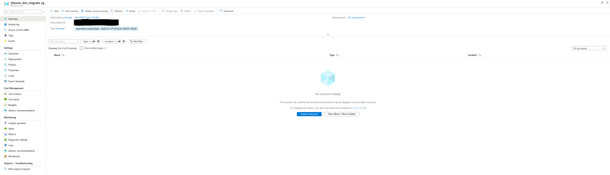
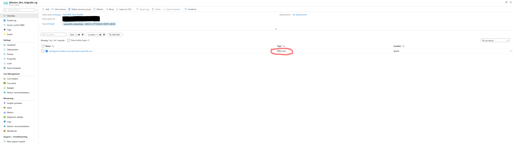
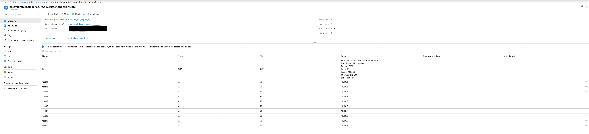
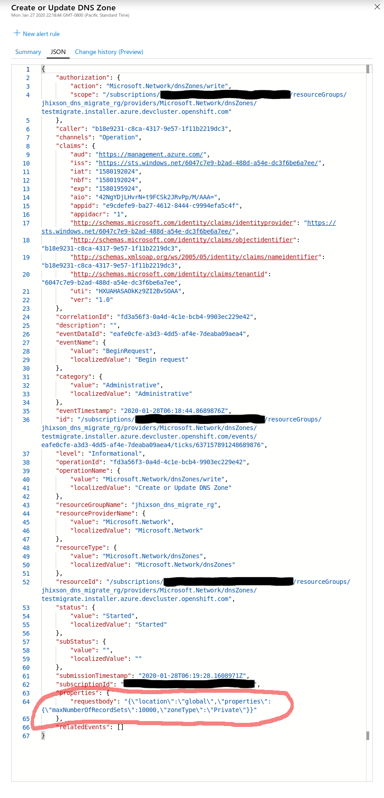
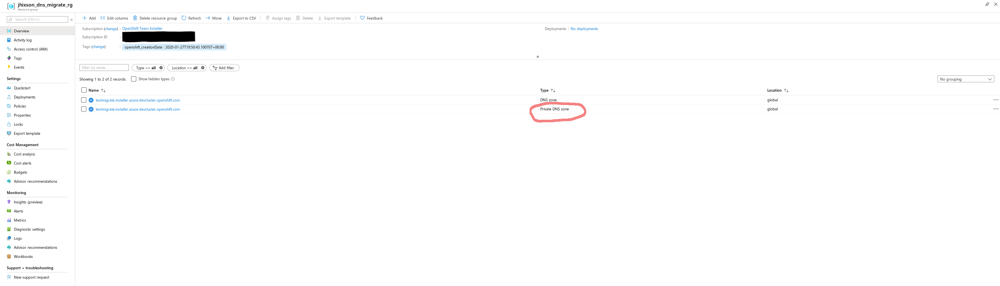
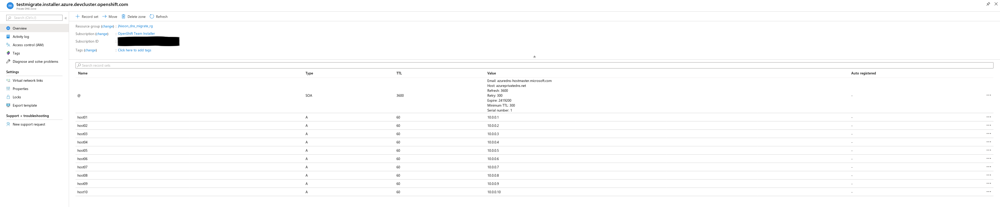
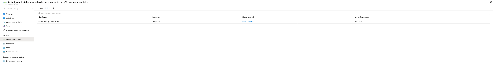

## Azure-DNStool

azure-dnstool is a tool for migrating AZure legacy private DNS zones to next generation private zones

## Build

```
# dep ensure
# go build
```

This will produce the azure-dnstool binary.

## Usage

Arguments:

    # Show legacy zones that are eligible to be migrated
    eligible

        # No arguments

    # list a zone(s)
    list

        # Show all zones and associated records, no other arguments are required
        -all

        # Show a legacy zone and records, requires a resource group
        -legacyZone=zone

        # Show a private zone and records, requires a resource group
        -privateZone=zone

        # The resource group for the specified zone
        -resourceGroup

    # migrate a zone
    migrate

        # The zone we want to migrate (required)
        -zone=example.com

        # The resource group to create the private zone in (required)
        -newResourceGroup=rg

        # The resource group of the legacy zone (optional)
        -oldResourceGroup=rg

        # The virtual network to create the private zone in (optional)
        -virtualNetwork=vnet

        # The resource group the virtual network is in (optional)
        # Required if specifying a virtual network
        -vnetResourceGroup=vrg

        # Link the newly created private zone to the virtual network for DNS (optional)
        -link=vnet

    # create a legacy zone for testing
    test

        # The resource group to create the legacy zone in (required)
        -resourceGroup=rg

        # The name of the legacy zone (required)
        -zone=example.com

Examples:

    # This will show legacy zones that can be migrated to private zones
    azure-dnstool eligible

    # This will show the legacy zone example.com
    azure-dnstool list -legacyZone=example.com -resourceGroup=rg

    # This will show the private zone example.com
    azure-dnstool list -privateZone=example.com -resourceGroup=rg

    # This will show the private zone example.com with debug output
    azure-dnstool -debug list -privateZone=example.com -resourceGroup=rg

    # This will migrate a legacy zone to a private zone
    # Without specifying -link, a virtual network link from the new zone to the vnet will not be created
    azure-dnstool migrate -oldResourceGroup=rg -newResourceGroup=rg -zone=example.com -virtualNetwork=myvnet -link

    # This will create a legacy zone with 10 A records
    azure-dnstool test -resourceGroup=rg -zone=example.com


## Workflow for migrating a legacy private zone to a new private zone
- list zones eligible for migration or know which ones to migrate
- gather details (resource groups, virtual networks, etc)
- perform the migration

## Example migration:

We start off with the empty resource group "jhixson_dns_migration_rg"



Next, We create a legacy private zone with mock records

```
[jhixson@redlap azure-dnstool]$ ./azure-dnstool -verbose test -resourceGroup=jhixson_dns_migrate_rg -zone=testmigrate.installer.azure.devcluster.openshift.com
INFO[0000] Credentials loaded from file "/home/jhixson/.azure/osServicePrincipal.json" 
INFO[0000] zone: testmigrate.installer.azure.devcluster.openshift.com ...  
INFO[0002] ok.                                          
INFO[0002] record: A host01 ...                         
INFO[0003] ok.                                          
INFO[0003] record: A host02 ...                         
INFO[0004] ok.                                          
INFO[0004] record: A host03 ...                         
INFO[0004] ok.                                          
INFO[0004] record: A host04 ...                         
INFO[0005] ok.                                          
INFO[0005] record: A host05 ...                         
INFO[0006] ok.                                          
INFO[0006] record: A host06 ...                         
INFO[0006] ok.                                          
INFO[0006] record: A host07 ...                         
INFO[0007] ok.                                          
INFO[0007] record: A host08 ...                         
INFO[0008] ok.                                          
INFO[0008] record: A host09 ...                         
INFO[0009] ok.                                          
INFO[0009] record: A host10 ...                         
INFO[0009] ok.                                          
```

Verify the legacy zone was created:



Verify the records have been created: 



Verify this is in fact, a legacy zone:



Now, list zones that are eligible for migrating:

```
[jhixson@redlap azure-dnstool]$ ./azure-dnstool eligible
INFO[0000] Credentials loaded from file "/home/jhixson/.azure/osServicePrincipal.json" 
INFO[0002] legacy zone=testmigrate.installer.azure.devcluster.openshift.com resourceGroup=jhixson_dns_migrate_rg 
```

Let's see what the zone looks like from the command line:

```
[jhixson@redlap azure-dnstool]$ ./azure-dnstool -verbose list -legacyZone=testmigrate.installer.azure.devcluster.openshift.com -resourceGroup=jhixson_dns_migrate_rg
INFO[0000] Credentials loaded from file "/home/jhixson/.azure/osServicePrincipal.json" 
INFO[0002] LegacyZone: testmigrate.installer.azure.devcluster.openshift.com 
INFO[0002] @ SOA 3600   Email: azuredns-hostmaster.microsoft.com 
INFO[0002]              Host: internal.cloudapp.net     
INFO[0002]              Refresh: 3600                   
INFO[0002]              Retry: 300                      
INFO[0002]              Expire: 2419200                 
INFO[0002]              Minimum TTL: 300                
INFO[0002]              Serial: 1                       
INFO[0002] host01 A 60     10.0.0.1                     
INFO[0002] host02 A 60     10.0.0.2                     
INFO[0002] host03 A 60     10.0.0.3                     
INFO[0002] host04 A 60     10.0.0.4                     
INFO[0002] host05 A 60     10.0.0.5                     
INFO[0002] host06 A 60     10.0.0.6                     
INFO[0002] host07 A 60     10.0.0.7                     
INFO[0002] host08 A 60     10.0.0.8                     
INFO[0002] host09 A 60     10.0.0.9                     
INFO[0002] host10 A 60     10.0.0.10                    
```

Everything looks good, so we can migrate this zone:

```
[jhixson@redlap azure-dnstool]$ ./azure-dnstool -verbose migrate -oldResourceGroup=jhixson_dns_migrate_rg -newResourceGroup=jhixson_dns_migrate_rg -zone=testmigrate.installer.azure.devcluster.openshift.com -virtualNetwork=jhixson_test_vnet -vnetResourceGroup=jhixson_vnet_rg -link
INFO[0000] Credentials loaded from file "/home/jhixson/.azure/osServicePrincipal.json" 
INFO[0002] zone: testmigrate.installer.azure.devcluster.openshift.com ...  
INFO[0036] ok.                                          
INFO[0036] record: SOA @ ...                            
INFO[0038] ok.                                          
INFO[0038] record: A host01 ...                         
INFO[0038] ok.                                          
INFO[0038] record: A host02 ...                         
INFO[0039] ok.                                          
INFO[0039] record: A host03 ...                         
INFO[0040] ok.                                          
INFO[0040] record: A host04 ...                         
INFO[0041] ok.                                          
INFO[0041] record: A host05 ...                         
INFO[0041] ok.                                          
INFO[0041] record: A host06 ...                         
INFO[0042] ok.                                          
INFO[0042] record: A host07 ...                         
INFO[0043] ok.                                          
INFO[0043] record: A host08 ...                         
INFO[0044] ok.                                          
INFO[0044] record: A host09 ...                         
INFO[0045] ok.                                          
INFO[0045] record: A host10 ...                         
INFO[0046] ok.                                          
INFO[0046] link: jhixson_vnet_rg-network-link ...       
INFO[0081] ok.                                          
```

Verify from the command line the new zone has been migrated:

```
[jhixson@redlap azure-dnstool]$ ./azure-dnstool -verbose list -privateZone=testmigrate.installer.azure.devcluster.openshift.com -resourceGroup=jhixson_dns_migrate_rg
INFO[0000] Credentials loaded from file "/home/jhixson/.azure/osServicePrincipal.json" 
INFO[0002] PrivateZone: testmigrate.installer.azure.devcluster.openshift.com 
INFO[0002] @ SOA 3600   Email: azuredns-hostmaster.microsoft.com 
INFO[0002]              Host: azureprivatedns.net       
INFO[0002]              Refresh: 3600                   
INFO[0002]              Retry: 300                      
INFO[0003]              Expire: 2419200                 
INFO[0003]              Minimum TTL: 300                
INFO[0003]              Serial: 1                       
INFO[0003] host01 A 60     10.0.0.1                     
INFO[0003] host02 A 60     10.0.0.2                     
INFO[0003] host03 A 60     10.0.0.3                     
INFO[0003] host04 A 60     10.0.0.4                     
INFO[0003] host05 A 60     10.0.0.5                     
INFO[0003] host06 A 60     10.0.0.6                     
INFO[0003] host07 A 60     10.0.0.7                     
INFO[0003] host08 A 60     10.0.0.8                     
INFO[0003] host09 A 60     10.0.0.9                     
INFO[0003] host10 A 60     10.0.0.10                    
```

Verify from the the web UI that zone has been created:



Verify the records have been migrated:



Verify the virtual network link was created:



That is how a migration is done. This can be scripted very easily. 